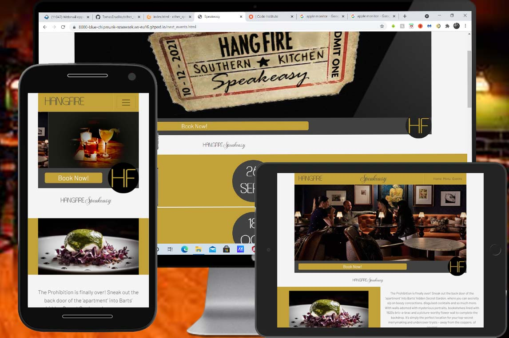
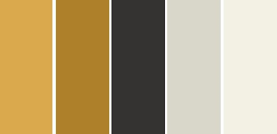
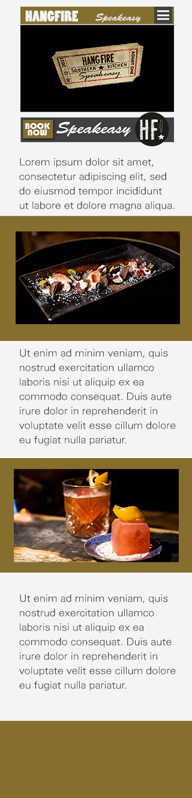
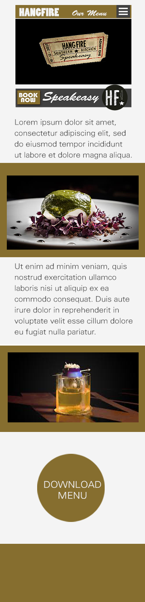
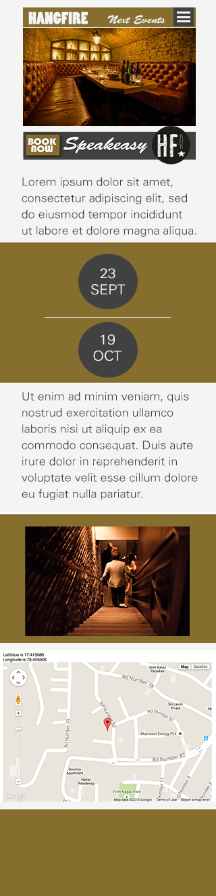

<link rel="stylesheet" href="assets/css/readme_styles.css">

<h1 align="center">Hangfire Speakeasy Website</h1>

[View the live project here.](https://tomaserudito.github.io/other_speakeasy/)

This is the website created for a restaurant called Hangfire. They are hosting a new series of events under the name “Hangfire Speakeasy”. These events are special events where they create special food and drinks menus for each event.

 
<h2 align="center"></h2> 

## Design 
 

The spaces are limited, and they must be reserved, this gives the event some exclusivity value. The idea around the name, exclusivity, and the type of food / drinks they will create define the colour scheme used for the website: The roaring 20’s.
 
 
<h2 align="center"></h2>
 

The approach for the layout was focused on the power of the imagery. The visitor should feel the ambient and the “essence” of the events without need to read long texts. The images are telling the story. Based on this principle, we searched for powerful images that represent the concept clearly: nice food, exciting drinks, cool and relaxed people… all involved in a golden and dark ambient.

The information’s organization should be simple answering 3 questions:

•	Who are we?

•	What do we offer?

•	How can you get what we offer?

So, the website is divided in 3 pages:

•	Index – Presentation of the new events.

•	Menu – Presentation of the food and drinks.

•	Next Events – How to book / when.

The potential customers would be people between 25 and 45 years old, with a medium / high income. These group of people usually are professionals and they main device to connect socially is the mobile phone / tablet, for this reason the design of the website has been created focused on the mobile first approach.

This was the proposed design for the different pages.

 

 
 

The structure is simple so the users can navigate easily through the content, get the information fast, and they should be able of complete the purchase at any moment: 

•	Header with navigation menu.

•	Main suggestive image.

•	Banner with booking access.

•	Content with big imagery.

•	Extra information (menu / location…).

•	Footer with social media links

The typographies used are Asanine (used for the Hangfire logo), Montecarlo (used for the Speakeasy logo), and Barlow, a very easy to read typography that matches the retro and elegant style of the design (used for all the text on the website).

 

## UX Goals 
 

<h3>First Time Visitors</h3>

•	Should be able to answer the 3 questions we proposed before (Who are we? / What do we offer? / How can I get it?) easily.

•	Should feel the ambience and the Speakeasy story.

•	Should be comfortable searching for more information.

•	Should want to share the website with others.

 
<h3>Returning visitors</h3>

•	Should want to see when new events / menus are available.

•	Should be able to book fast.

•	Should be reassured on the feeling about the events..

 
<h3>Frequent visitors</h3>

•	Should want to see when new events / menus are available.

•	Should be able to book fast.

 

<h3>UX solutions</h3>
 

<h3>First Time Visitors</h3>

•	Should be able to answer the 3 questions we proposed before (Who are we? / What do we offer? / How can I get it?) easily.

<ul>
<li class="indent">The name of the company, logo and events' name are on each page (header, banners,..)</li>
<li class="indent">The images show what are we offering (food, drinks, ambience,...)</li>
<li class="indent">There are buttons to book the events on each page</li>
</ul>

•	Should feel the ambience and the Speakeasy story.

<ul>
<li class="indent">The colours and the images / typography work together to create the desired feeling.</li>
</ul>

•	Should be comfortable searching for more information.

<ul>
<li class="indent">The buttons to access the information are big and the pages are simple and tidy, so the information is clear and the process to find out more too.</li>
</ul>

•	Should want to share the website with others.

<ul>
<li class="indent">The website try to be elegant with nice images and visually pleasant, so the users could be tempted to share it with friends.</li>
</ul>
 
<h3>Returning visitors</h3>

•	Should want to see when new events / menus are available.

<ul>
<li class="indent">The menus have their own page with a big button to access to them so it's easy to get them.</li>
<li class="indent">The events have their own page too and you can easily find out when are the coming up events.</li>
</ul>

•	Should be able to book fast.

<ul>
<li class="indent">There are booking buttons on each page and the user could book without scrolling the page.</li>
</ul>

•	Should be reassured on the feeling about the events..

<ul>
<li class="indent">The selection of colours and powerful images help to created a comfortable sensation, so the visitor can spend time on the website.</li>
</ul>
 
<h3>Frequent visitors</h3>

•	Should want to see when new events / menus are available.

<ul>
<li class="indent">The menus have their own page with a big button to access to them so it's easy to get them.</li>
<li class="indent">The events have their own page too and you can easily find out when are the coming up events.</li>
<li class="indent">The footer of each page has links to the company's social media profiles, allowing the fequent visitor engagement with the company.</li>
</ul>

•	Should be able to book fast.

<ul>
<li class="indent">There are booking buttons on each page and the user could book without scrolling the page.</li>
</ul>
 

## Technologies used 
 

The languages used are:

•	HTML 5

•	CSS

Also, during the creation of the different elements of the project, I used:
	

•	Photoshop – Create and / or edit images like the logo.

•	Bootstrap 4.2.3 – To help with the responsive design.

•	JQuery – Used for the navigation bar on mobiles and the carousel on the index page.

•	Google Fonts – Used for the Barlow and Montecarlo font families.

•	Font Awesome – Used for the icons on all the pages.

•	Git – Used for the version control within Gitpod.

•	GitHub – Used to store the project.

 

## Testing 
 
	

The W3C validator has been used to ensure that every HTML and CSS files are free of syntax errors*.

*(I decided to ignore the warning about using sections without a header as this helps in the HTML structure to be clearer and some sections’ contents are mainly graphic and don’t need any header or introduction).

The website has been tested on different browsers:

•	Google Chrome

•	Microsoft Edge

•	Opera

•	Firefox

Also has been tested on different devices:

•	Laptop (Windows)

•	Desktop (Windows)

•	Android tablets

•	Mobile phones (Android)

 

More testing has been done about usability and user experience. To achieve this, I proposed to some friends to navigate through the website and answer the questions about the UX goals explained before:

<h3>First Time Visitors</h3>

•	Should be able to answer the 3 questions we proposed before (Who are we? / What do we offer? / How can I get it?) easily.

<ul>
<li class="indent">The users can identify the brand, the name of the events, what are the events about and how to book them.</li>
</ul>

•	Should feel the ambience and the Speakeasy story.

<ul>
<li class="indent">The users understand the kind of events that the company offers and their ambience / style.</li>
</ul>

•	Should be comfortable searching for more information.

<ul>
<li class="indent">The user can easily find more information when required.</li>
</ul>

•	Should want to share the website with others.

<ul>
<li class="indent">The perceptions of the website are: “stylish”, “elegant” and “beautiful” and they would share it with friends</li>
</ul>
 
<h3>Returning visitors</h3>

•	Should want to see when new events / menus are available.

<ul>
<li class="indent">When returning, the users go directly to see if there are new menus or events.</li>
</ul>

•	Should be able to book fast.

<ul>
<li class="indent">The users find very easy to book for upcoming events.</li>
</ul>

•	Should be reassured on the feeling about the events..

<ul>
<li class="indent">The users enjoyed with the quality of the images, and they can visualize themselves in the event.</li>
</ul>
 
<h3>Frequent visitors</h3>

•	Should want to see when new events / menus are available.

<ul>
<li class="indent">Again, the users check if there are new events and / or new menus.</li>
</ul>

•	Should be able to book fast.

<ul>
<li class="indent">The users can book from the first page, and they can book at any moment during their visit.</li>
</ul>
 

## Bugs 
 
	

On the header, on some devices appears a white line between the header and the navigation bar.

 

## Credits 
 

<h3>Images</h3> 

The images used on the website belong to some restaurants and they are used on this project only for academic purposes:
	

•	Alficon, Athens (photo by Dimitris Tsitsos) <a href="https://www.alficonathens.com/" target="_blank">View</a>

•	Le speakeasy, Cannes <a href="https://www.lespeakeasy.com/" target="_blank">View</a>

•	Speakeasy, Barcelona <a href="http://www.drymartiniorg.com/locales/speakeasy/" target="_blank">View</a>

•	El Gin Tub, Sitges <a href="https://elgintub.com/" target="_blank">View</a>

•	Bo Speakeasy, Mexico

•	The Hoxton, Portland <a href="https://thehoxton.com/portland/" target="_blank">View</a>

•	Tt Liquor, Bar Cellar, London <a href="https://ttliquor.co.uk/" target="_blank">View</a>

•	The Office, Chicago <a href="https://www.theaviary.com/" target="_blank">View</a>

•	PDT, Hong Kong <a href="https://www.mandarinoriental.com/hong-kong/the-landmark/fine-dining/bars/pdt?htl=LMHKG&kw=LMHKG_pdt&eng=yext&src=local" target="_blank">View</a>

 

<h3>External help</h3> 

To find solutions to some difficulties during the creation of the project, I used:
	

•	Bootstrap documentation

•	W3Schools

•	Stackoverflow

 

<h3>Thanks to:</h3> 

Aaron Sinnott, he was my mentor on this project, and he gave me good advice about it.

All the team from Code Institute, for the high quality of the content of the course.

